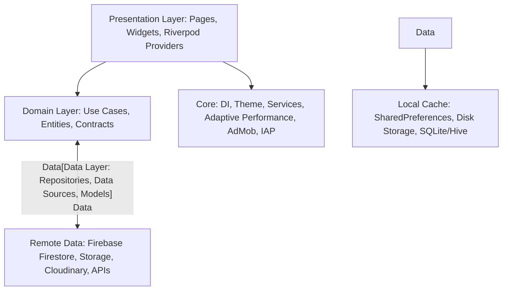

<div align="center">

  

  # Royal Pixels
  ### Premium 4K Wallpapers & Backgrounds for Android

  <p align="center">
    <strong>Elevate your device aesthetics with ultra-high-definition curated visuals, AI-driven mood recommendations, dynamic palette generation, and automated daily scheduling.</strong>
  </p>

  <p align="center">
    <a href="https://play.google.com/store/apps/details?id=com.royalpixels.app">
      
    </a>
    <a href="https://github.com/shubham143dot/PROFESSIONAL-WALLPAPER-APPLICATION-Royal-pixels-/releases">
      
    </a>
  </p>

  <p align="center">
    
    
    
    
    
    
    
    
  </p>

</div>

---

## 📋 Table of Contents

- [📱 Download & Installation](#-download--installation)
  - [Install from Google Play Store](#install-from-google-play-store)
  - [Join the Google Play Beta / Open Testing Track](#join-the-google-play-beta--open-testing-track)
  - [Direct APK Sideload (GitHub Releases)](#direct-apk-sideload-github-releases)
  - [Device Compatibility & System Requirements](#device-compatibility--system-requirements)
- [✨ Key Features](#-key-features)
- [🏗 Architecture & Engineering Highlights](#-architecture--engineering-highlights)
  - [Adaptive Performance Tier System](#adaptive-performance-tier-system)
  - [Impeller Vulkan Acceleration](#impeller-vulkan-acceleration)
- [📁 Project Structure](#-project-structure)
- [🚀 Developer Getting Started](#-developer-getting-started)
  - [Prerequisites](#prerequisites)
  - [Step 1: Clone Repository](#step-1-clone-repository)
  - [Step 2: Install Flutter Dependencies](#step-2-install-flutter-dependencies)
  - [Step 3: Firebase Configuration](#step-3-firebase-configuration)
  - [Step 4: Environment Variables & Secrets](#step-4-environment-variables--secrets)
  - [Step 5: Run Debug Build](#step-5-run-debug-build)
- [📦 Production Build & Release Guide](#-production-build--release-guide)
  - [Keystore & Signing Setup](#keystore--signing-setup)
  - [Building Android App Bundle (AAB) for Play Store](#building-android-app-bundle-aab-for-play-store)
  - [Building Release APK (Direct Distribution)](#building-release-apk-direct-distribution)
  - [Code Shrinking, Obfuscation & ProGuard](#code-shrinking-obfuscation--proguard)
- [🔒 Security & Permissions](#-security--permissions)
- [🧪 Testing & Quality Assurance](#-testing--quality-assurance)
- [🤝 Contributing](#-contributing)
- [📄 License & Contact](#-license--contact)

---

## 📱 Download & Installation

### Install from Google Play Store

Royal Pixels is available for direct installation from Google Play:

<p align="center">
  <a href="https://play.google.com/store/apps/details?id=com.royalpixels.app" target="_blank">
    
  </a>
</p>

1. **Direct Link**: Open [**Royal Pixels on Google Play Store**](https://play.google.com/store/apps/details?id=com.royalpixels.app) on your Android device or desktop browser.
2. **Search in App**: Open the **Google Play Store** app, search for `Royal Pixels` or package ID `com.royalpixels.app`.
3. Tap **Install** to automatically download and configure the app for your device.

---

### Join the Google Play Beta / Open Testing Track

To test cutting-edge features before official release:

1. Visit the [Google Play Store listing](https://play.google.com/store/apps/details?id=com.royalpixels.app).
2. Scroll down to the **"Join the beta"** section.
3. Tap **Join** and confirm.
4. Once enrolled (usually takes a few minutes), update the app to receive the latest beta build.

---

### Direct APK Sideload (GitHub Releases)

If you do not have Google Play Services installed or wish to install specific release binaries:

1. Navigate to [GitHub Releases](https://github.com/shubham143dot/PROFESSIONAL-WALLPAPER-APPLICATION-Royal-pixels-/releases).
2. Download the latest `royal-pixels-vX.X.X.apk`.
3. On your Android device, open the downloaded APK and follow the system prompts to allow installation from your file manager or browser.

---

### Device Compatibility & System Requirements

| Specification | Minimum Requirement | Recommended |
|---|---|---|
| **Operating System** | Android 7.0 (API Level 24, Nougat) | Android 12+ (API Level 31+) |
| **Target Architecture** | ARM64 (`arm64-v8a`), ARMv7 (`armeabi-v7a`), x86_64 | ARM64 (`arm64-v8a`) |
| **RAM** | 2 GB (Runs in Adaptive Low-Tier) | 4 GB - 8 GB+ (Ultra HD Cache Tier) |
| **Display Refresh Rate** | 60 Hz | 90 Hz / 120 Hz / Dynamic Variable |
| **Internet Connection** | Required for browsing & downloading 4K assets | High-speed Wi-Fi / 4G / 5G |
| **Google Services** | Google Play Services (Auth, FCM, Billing, AdMob) | Active Google Account |

---

## ✨ Key Features

- **🎨 Handpicked 4K & Ultra HD Collection**: High-dynamic-range wallpapers with vivid color grading, abstract designs, nature, anime, minimal, and AMOLED dark themes.
- **⚡ Adaptive Performance Engine**: Dynamic 3-tier memory scaling (Low 2GB, Standard 4GB, High 8GB+) preventing out-of-memory crashes while ensuring lightning-fast scrolling.
- **🔄 Auto-Wallpaper Scheduler**: Powered by Android WorkManager, automatically rotates wallpapers on your lock screen, home screen, or both at customizable intervals.
- **🌤 Live Weather & Mood Engine**: Intelligently recommends visual themes matching current atmospheric weather (sunny, rainy, foggy, stormy) and time-of-day moods.
- **🎙 Voice & OCR Search**: Search wallpapers hands-free using integrated speech recognition (`speech_to_text`) or scan text within images (`google_mlkit_text_recognition`).
- **🎯 Dynamic Palette Extraction**: Automatically extracts dominant and harmonious accent colors from wallpapers to dynamically tint UI elements.
- **💎 PRO Membership & In-App Purchases**: Seamless Google Play Billing integration offering a lifetime ad-free VIP pass, unlimited high-res downloads, and exclusive collections.
- **🎁 Rewarded Diamond System**: Earn diamonds via AdMob rewarded videos to unlock select premium wallpapers without requiring direct payment.
- **🛡 Anti-Piracy & Screen Protection**: Hardened against unauthorized capture with native screen protection and Firebase App Check (Play Integrity) validation.
- **🔗 Deep Linking**: Instant wallpaper preview and sharing via `royalpixels://wallpaper/:id` deep links.

---

## 🏗 Architecture & Engineering Highlights

Royal Pixels follows clean architecture principles with a strict separation of concerns:



### Adaptive Performance Tier System

To guarantee butter-smooth frame rates (60/90/120 FPS) across everything from budget devices to flagship flagships, Royal Pixels auto-detects RAM and hardware capacity on startup:

| Tier | Target Devices | Image Cache Limits | Concurrency & Prefetch |
|---|---|---|---|
| **Low-End Tier** | ≤ 2 GB RAM | 40 items / 40 MB max | Serial loading, reduced prefetching |
| **Standard Tier** | 3 GB - 4 GB RAM | 100 items / 100 MB max | Balanced parallel prefetch |
| **High-End Tier** | ≥ 8 GB RAM | 250 items / 350 MB max | Aggressive parallel prefetch & high-res caching |

### Impeller Vulkan Acceleration

Royal Pixels has Impeller enabled by default on Android 12+ (`io.flutter.embedding.android.EnableImpeller = true`), leveraging Vulkan shaders to eliminate runtime shader compilation jank and dropped frames.

---

## 📁 Project Structure

```text
royal_pixels/
├── android/                     # Native Android Gradle configuration & manifests
│   ├── app/
│   │   ├── build.gradle.kts     # SDK targets, ProGuard, signingConfigs, desugaring
│   │   ├── proguard-rules.pro   # Keep rules for MLKit, Firebase, In-App Purchase
│   │   └── src/main/
│   │       └── AndroidManifest.xml # Permissions, deep links, AdMob ID, Impeller flag
│   └── key.properties           # Keystore credentials reference (gitignored)
├── assets/                      # App logos, background assets, and QR code
├── lib/
│   ├── core/                    # Cross-cutting concerns
│   │   ├── ads/                 # AdMob banner, interstitial, and rewarded ad managers
│   │   ├── constants/           # AppConstants, IapConstants, AnimationConstants
│   │   ├── di/                  # Service locator configuration (GetIt)
│   │   ├── l10n/                # Internationalization & localization strings
│   │   ├── services/            # AdaptivePerformance, IAP, Weather, Notification, Scheduler
│   │   └── theme/               # Dark/Light design systems, colors, typography
│   ├── data/                    # Models, repository implementations, remote data sources
│   ├── domain/                  # Entities, repository interfaces, use case business logic
│   ├── presentation/            # UI components, pages, routing, and Riverpod controllers
│   │   ├── navigation/          # GoRouter configuration & deep link handlers
│   │   ├── pages/               # Home, Category, Detail, Diamond, Notifications, Payment, Upload
│   │   └── providers/           # Riverpod state providers
│   └── main.dart                # Application entrypoint, service bootstrap & performance init
├── scripts/                     # Operational scripts for database maintenance & seeding
├── pubspec.yaml                 # Dependencies and assets declaration
└── README.md                    # Project documentation
```

---

## 🚀 Developer Getting Started

### Prerequisites

Ensure you have the following installed on your development workstation:

- [**Flutter SDK**](https://docs.flutter.dev/get-started/install): Version `^3.5.0` (Stable channel recommended)
- [**Dart SDK**](https://dart.dev/get-dart): Version `^3.5.0` (Included with Flutter)
- [**Android Studio**](https://developer.android.com/studio) or **VS Code** with Flutter & Dart extensions
- [**Java Development Kit (JDK)**](https://www.oracle.com/java/technologies/downloads/): Version **17**
- **Android SDK**:
  - `compileSdk`: **36**
  - `targetSdk`: **36**
  - `minSdk`: **24**

Verify your environment by running:
```bash
flutter doctor -v
```

---

### Step 1: Clone Repository

```bash
git clone https://github.com/shubham143dot/PROFESSIONAL-WALLPAPER-APPLICATION-Royal-pixels-.git
cd PROFESSIONAL-WALLPAPER-APPLICATION-Royal-pixels-
```

---

### Step 2: Install Flutter Dependencies

```bash
flutter pub get
```

---

### Step 3: Firebase Configuration

Royal Pixels requires a valid Firebase project with Firestore, Authentication, Cloud Storage, and Firebase Cloud Messaging (FCM).

1. Create a Firebase project named `royal-pixel` (or your own) in the [Firebase Console](https://console.firebase.google.com/).
2. Add an **Android App** with package name `com.royalpixels.app`.
3. Download `google-services.json` and place it in the Android app directory:
   ```text
   android/app/google-services.json
   ```
4. Configure SHA-1 and SHA-256 fingerprint hashes in Firebase Project Settings:
   ```bash
   # Extract debug signing SHA keys
   keytool -list -v -keystore ~/.android/debug.keystore -alias androiddebugkey -storepass android -keypass android
   ```
5. Enable **Google Sign-In** in *Authentication -> Sign-in method*.
6. Enable **Cloud Firestore** and **Firebase Storage** in test or production security mode.

---

### Step 4: Environment Variables & Secrets

Create or verify the following configuration files:

#### 1. Keystore Configuration (`android/key.properties`)
Create `android/key.properties` for release signing:
```properties
storePassword=your_keystore_password
keyPassword=your_key_password
keyAlias=your_key_alias
storeFile=your_keystore_filename.jks
```

> **Note**: In development mode, Gradle falls back to the default debug keystore if `key.properties` does not exist.

#### 2. OpenWeather API (Optional)
If configuring live weather-adaptive wallpapers, update your OpenWeather API key in [`lib/core/services/weather_service.dart`](lib/core/services/weather_service.dart).

---

### Step 5: Run Debug Build

Connect your physical Android device via USB (or start an emulator) and run:

```bash
flutter run
```

---

## 📦 Production Build & Release Guide

### Keystore & Signing Setup

If you need to generate a new production upload keystore:

```bash
keytool -genkey -v -keystore android/app/upload-keystore.jks \
  -keyalg RSA -keysize 2048 -validity 10000 \
  -alias upload
```

Place `upload-keystore.jks` in `android/app/` and reference it inside `android/key.properties`.

---

### Building Android App Bundle (AAB) for Play Store

Google Play requires publishing via Android App Bundle (`.aab`):

```bash
# Clean previous build artifacts
flutter clean
flutter pub get

# Build production app bundle with code shrinking and tree shaking
flutter build appbundle --release
```

The output bundle will be generated at:
```text
build/app/outputs/bundle/release/app-release.aab
```

Upload this `.aab` file to **Google Play Console** -> **Production** or **Testing (Internal / Closed / Open)** track.

---

### Building Release APK (Direct Distribution)

For sideloading or direct distribution:

```bash
# Build universal release APK
flutter build apk --release

# OR build split per-ABI APKs for smaller download sizes (armeabi-v7a, arm64-v8a, x86_64)
flutter build apk --release --split-per-abi
```

The output APK will be generated at:
```text
build/app/outputs/flutter-apk/app-release.apk
```

---

### Code Shrinking, Obfuscation & ProGuard

In production release builds, code shrinking, resource shrinking, and R8 obfuscation are enabled:

```kotlin
buildTypes {
    release {
        isMinifyEnabled = true
        isShrinkResources = true
        proguardFiles(
            getDefaultProguardFile("proguard-android-optimize.txt"),
            "proguard-rules.pro"
        )
    }
}
```

Critical Flutter and native SDK rules (In-App Purchases, AdMob, MLKit, Desugaring) are maintained in [`android/app/proguard-rules.pro`](android/app/proguard-rules.pro).

---

## 🔒 Security & Permissions

### Permissions Overview

| Permission | Justification |
|---|---|
| `android.permission.INTERNET` | Downloading high-resolution 4K wallpaper assets & Firebase API sync. |
| `android.permission.SET_WALLPAPER` | Setting wallpapers directly to Home Screen, Lock Screen, or both. |
| `android.permission.POST_NOTIFICATIONS` | Android 13+ permission for daily drops and wallpaper schedule notifications. |
| `android.permission.RECEIVE_BOOT_COMPLETED` | Rescheduling wallpaper rotation background workers after device restart. |
| `android.permission.RECORD_AUDIO` | Hands-free wallpaper voice search query input. |
| `com.android.vending.BILLING` | Google Play In-App Billing for lifetime PRO upgrades. |
| `com.google.android.gms.permission.AD_ID` | Compliant advertising identifier access for AdMob monetization. |

### Data Protection & Privacy

- **Screen Protector**: Sensitive application views prevent screenshotting and screen recording using `screen_protector`.
- **Firebase App Check**: Hardened with Play Integrity provider on production builds to prevent unauthorized API access and botting.

---

## 🧪 Testing & Quality Assurance

Run static code analysis and unit tests before pushing code or creating pull requests:

```bash
# Analyze codebase for linter issues, deprecations, and potential bugs
flutter analyze

# Run unit and widget test suite
flutter test

# Format code adhering to official Dart conventions
dart format lib/ test/
```

---

## 🤝 Contributing

Contributions, feature requests, and bug reports are welcome!

1. **Fork the Repository**: Click the **Fork** button at the top right of GitHub.
2. **Create a Feature Branch**:
   ```bash
   git checkout -b feature/amazing-feature
   ```
3. **Commit Your Changes**:
   ```bash
   git commit -m "feat: Add amazing new wallpaper filter"
   ```
4. **Push to Your Branch**:
   ```bash
   git push origin feature/amazing-feature
   ```
5. **Open a Pull Request**: Submit your PR with a descriptive summary of your changes.

---

## 📄 License & Contact

Copyright © 2026 **Royal Pixels**. All rights reserved.

- **Developer**: Shubham & The Royal Pixels Team
- **GitHub Repository**: [shubham143dot/PROFESSIONAL-WALLPAPER-APPLICATION-Royal-pixels-](https://github.com/shubham143dot/PROFESSIONAL-WALLPAPER-APPLICATION-Royal-pixels-)
- **Google Play Store**: [Royal Pixels App](https://play.google.com/store/apps/details?id=com.royalpixels.app)
- **Support & Inquiries**: Create an issue in the [GitHub Issue Tracker](https://github.com/shubham143dot/PROFESSIONAL-WALLPAPER-APPLICATION-Royal-pixels-/issues).

<p align="center">
  Made with ❤️ and <strong>Flutter</strong>
</p>
